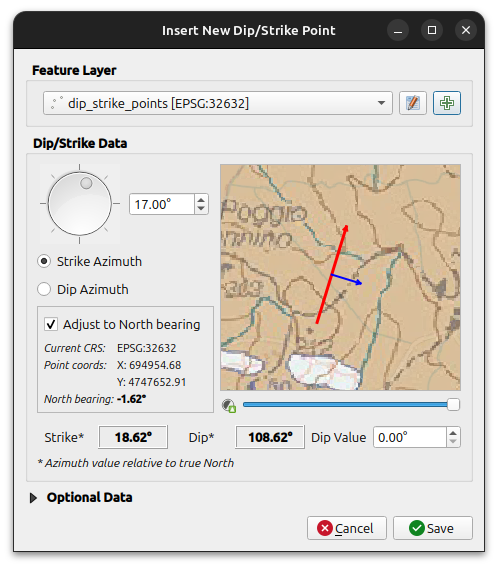

# Dip Strike Tools - QGIS Plugin

  

## About

Dip-Strike Tools is a QGIS plugin that aims to provide a set of tools for digitizing, managing, and analyzing plane orientation or attitude data (dip and strike) of planar geologic features. It currently provides basic tools to streamline the workflow for geologists working with structural geology datasets, enabling efficient dip and strike data capture and management within QGIS.

Read more in the [plugin documentation](https://fpennica.github.io/dip-strike-tools/).

- Credits: [CREDITS.md](CREDITS.md)
- Changelog: [CHANGELOG.md](CHANGELOG.md)

## License

Distributed under the terms of the [`GPLv2+` license](LICENSE).
