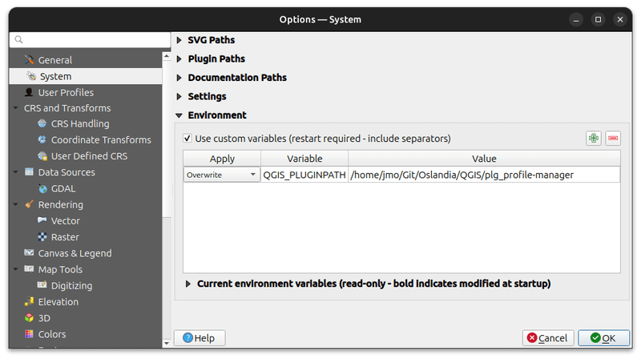
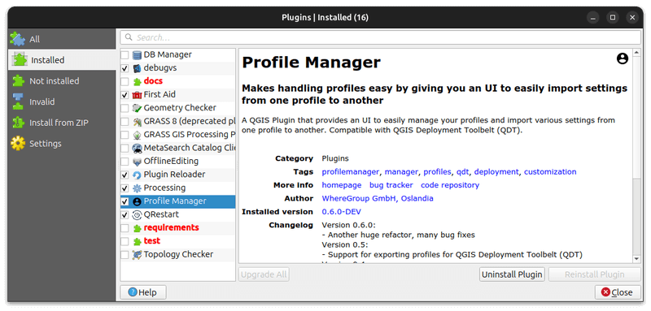

# Development

## Environment setup

## Prerequisites

Before setting up the development environment, you need to install some required libraries and the following tools:

1. **uv** - Fast Python package installer and dependency manager
2. **just** - Command runner for project automation

### Qt 5 libraries and tools

#### Fedora 42

```bash
sudo dnf install qgis qgis-devel python3-devel qt5-designer qt5-linguist
```

### Install uv

```bash
# Using curl (recommended)
curl -LsSf https://astral.sh/uv/install.sh | sh

# Or using pip
pip install uv
```

### Install just

```bash
# On Ubuntu/Debian
sudo apt install just

# Or using cargo
cargo install just

# Or download from releases
curl --proto '=https' --tlsv1.2 -sSf https://just.systems/install.sh | bash -s -- --to ~/.local/bin
```

### Suggested IDE: Visual Studio Code

This project includes pre-configured settings for VS Code, available in `.vscode` folder, including linting, formatting and tasks settings.

To get started with VS Code:

```bash
# Install VS Code (Ubuntu/Debian)
sudo snap install code --classic

# Or download from https://code.visualstudio.com/

# Open the project in VS Code
code .
```

VS Code will automatically suggest installing recommended extensions when you open the project.

## Quick Setup (Recommended)

:::{warning}
At the moment the quick setup is **only** supported on **Linux**. For other OS environments, follow and adapt the manual setup instructions.
:::

The easiest way to set up the development environment is using the automated setup:

```bash
# Create virtual environment, install dependencies, and set up development links
just bootstrap-dev
```

This command will:

- Create a Python virtual environment with system-site-packages (for PyQGIS)
- Install all development dependencies using uv
- Create symbolic links for development

## Manual Setup

If you prefer to set up the environment step by step:

### 1. Create virtual environment

Using uv (recommended):

```bash
# Create virtual environment with system-site-packages for PyQGIS
just create-venv

# Manual override of the system python version if needed
just create-venv-manual 3.13
```

Alternative methods:

Using [qgis-venv-creator](https://github.com/GispoCoding/qgis-venv-creator) through [pipx](https://pipx.pypa.io):

```bash
# Install pipx if not already installed
sudo apt install pipx

# Create QGIS-compatible virtual environment
pipx run qgis-venv-creator --venv-name ".venv"
```

Traditional method:

```bash
# Create virtual environment linking to system packages (for PyQGIS)
python3 -m venv .venv --system-site-packages
source .venv/bin/activate
```

### 2. Install development dependencies

With uv (recommended):

```bash
# Install all dependency groups (dev, testing, docs, ci)
uv sync --all-groups

# Or install specific groups
uv sync --group dev --group testing
```

Traditional method:

```bash
# Activate virtual environment first
source .venv/bin/activate

# Upgrade pip and install dependencies
python -m pip install -U pip
python -m pip install -U pytest  # install dependencies listed in pyproject.toml

# Install git hooks (pre-commit)
pre-commit install
```

### 3. Development Links and QGIS Profile

#### Create Development Links

To develop the plugin, you need to create symbolic links so QGIS can find your plugin:

```bash
# Create symbolic links to your QGIS plugins directory
just dev-link

# Or specify a custom QGIS plugin path
just dev-link /path/to/your/qgis/plugins
```

#### Dedicated QGIS Profile

It's recommended to create a dedicated QGIS profile for the development of the plugin to avoid conflicts with other plugins.

1. From the command-line (a terminal with qgis executable in `PATH` or OSGeo4W Shell):

    ```bash
    # Linux
    qgis --profile plg_dip_strike_tools
    # Windows - OSGeo4W Shell
    qgis-ltr --profile plg_dip_strike_tools
    # Windows - PowerShell opened in the QGIS installation directory
    PS C:\Program Files\QGIS 3.40.4\LTR\bin> .\qgis-ltr-bin.exe --profile plg_dip_strike_tools
    ```

2. Then, set the `QGIS_PLUGINPATH` environment variable to the path of the plugin in profile preferences:

    

3. Finally, enable the plugin in the plugin manager (ignore invalid folders like documentation, tests, etc.):

    

#### Alternative: Using Docker

For a consistent development environment, you can use Docker to run QGIS:

```bash
# Pull the latest QGIS LTR Docker image
just qgis-ltr-pull

# Start QGIS in Docker (Linux only)
just qgis-docker
```

This automatically mounts your plugin directory and provides a clean QGIS environment.

## Common Development Tasks

The project uses `just` as a command runner to automate common development tasks. Here are the most useful commands:

```bash
# Show all available tasks
just

# Create virtual environment and set up development links
just bootstrap-dev

# Update dependencies to latest versions
just update-deps

# Run tests with coverage
just test

# Update translation files
just trans-update

# Compile translation files
just trans-compile

# Build documentation with auto-reload (for development)
just docs-autobuild

# Build HTML documentation
just docs-build-html

# Create development symlinks (if not using bootstrap-dev)
just dev-link

# Start QGIS LTR in Docker (Linux only)
just qgis-docker

# Package the plugin for distribution
just package <version>
```

### Using VS Code Tasks

If you're using VS Code, the project includes pre-configured tasks that you can run directly from the editor:

- **Ctrl+Shift+P** → "Tasks: Run Task" to see all available tasks
- **Upgrade Dependencies**: Update all development dependencies
- **Run Tests**: Execute the full test suite
- **Translation Update**: Update translation files
- **Translation Compile**: Compile translation files
- **Create Virtual Environment**: Set up the development environment
- **Sync Dependencies**: Install project dependencies

These tasks use the same `just` and `uv` commands but provide a convenient GUI interface within VS Code.

### Using uv directly

Use `uv run <command>` to ensure commands run in the correct virtual environment.

```bash
# Run commands in the virtual environment
uv run pytest
uv run ruff check
uv run pre-commit run --all-files

# Add new dependencies
uv add requests  # Runtime dependency
uv add --group dev black  # Development dependency
uv add --group testing pytest-mock  # Testing dependency

# Install packages
uv sync  # Install all dependencies
uv sync --group dev  # Install dev dependencies only
uv sync --all-groups  # Install all dependency groups

# Update dependencies
uv lock --upgrade  # Update lock file
uv sync  # Apply updates
```
